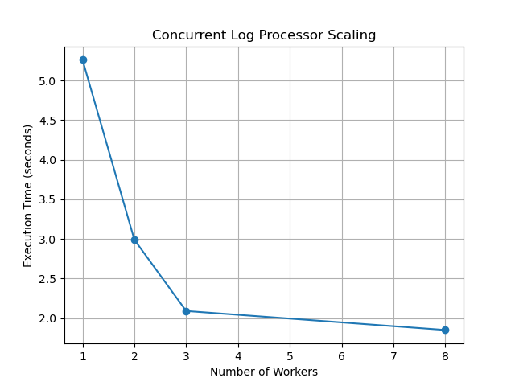

# Concurrent Log Processor Benchmark

## Overview

This project explores the performance characteristics of sequential versus concurrent log processing in Go.

The goal was to understand how workload type (I/O-bound vs CPU-bound) affects the benefits of concurrency and to measure how performance scales with multiple workers.

The project simulates a realistic backend workload by processing large log files and applying CPU-intensive operations to each line.

---

## Objectives

- Compare sequential and concurrent processing  
- Measure execution time and throughput  
- Analyze the impact of workload characteristics  
- Evaluate scaling behavior with multiple workers  

---

## Project Structure

cmd/  
  baseline/        Sequential implementation  
  concurrent/      Worker pool implementation  

internal/          Shared logic (parsing, processing, stats)  
testdata/          Sample log files  
docs/              Benchmark data and graphs  

---

## Implementation Details

### Baseline Version
Processes the log file sequentially, line by line.

### Concurrent Version
Uses a worker pool with goroutines and channels to process log lines in parallel. A mutex ensures thread-safe aggregation of results.

To simulate a CPU-bound workload, each log line is hashed multiple times using SHA-256.

---

## Benchmark Results

Sequential execution time:  
~5.26 seconds  

Concurrent execution time (8 workers):  
~1.85 seconds  

This demonstrates how concurrency improves performance when the workload becomes CPU-bound.

---

## Scaling Analysis

Performance improves significantly as the number of workers increases up to the number of available CPU cores. Beyond that point, gains diminish due to synchronization overhead and scheduling costs.

See the scaling graph below:

---

## Key Learnings

- Concurrency does not always improve performance  
- Understanding bottlenecks is critical before parallelizing  
- CPU-bound workloads benefit from worker pools  
- Synchronization overhead limits scalability  
- Benchmarking and measurement guide optimization decisions  

---

## How to Run

Run the sequential version:

go run cmd/baseline/main.go

Run the concurrent version:

go run cmd/concurrent/main.go

---

## Future Improvements

- CPU profiling with pprof  
- Pipeline architecture with multiple stages  
- Dynamic worker configuration  
- Throughput measurement (lines/sec)  
